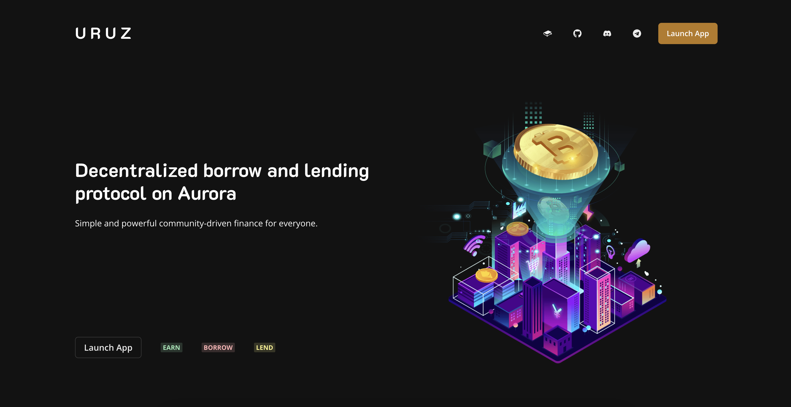
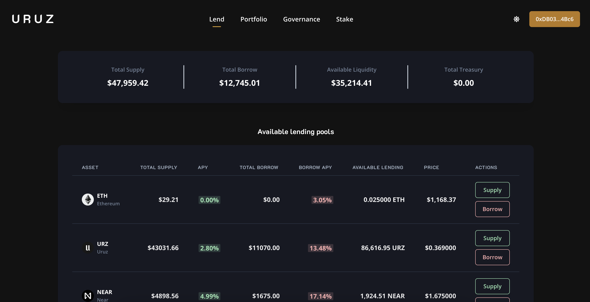
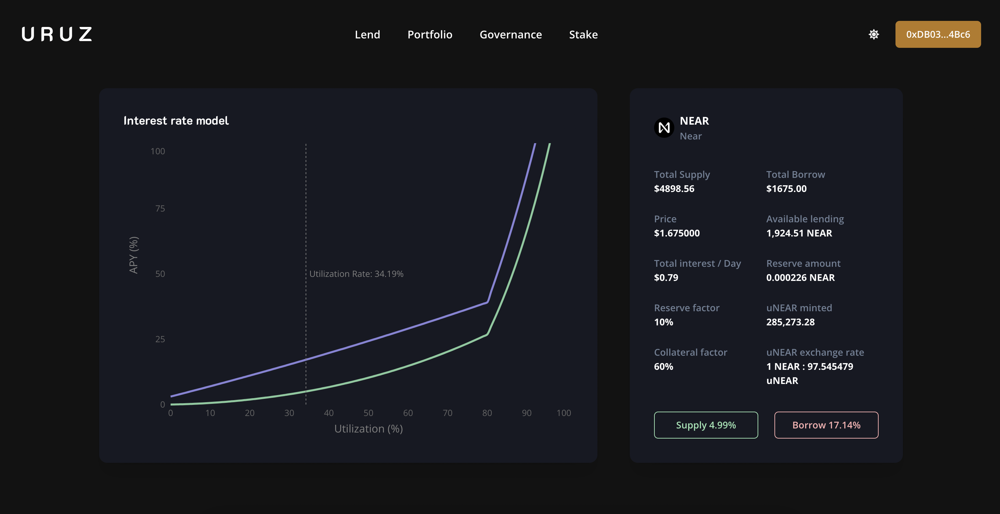
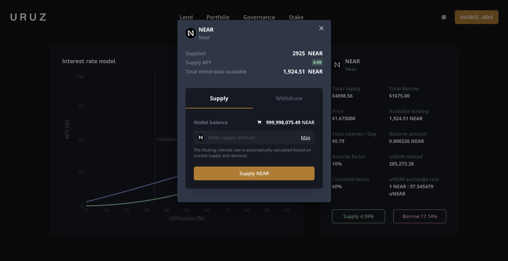
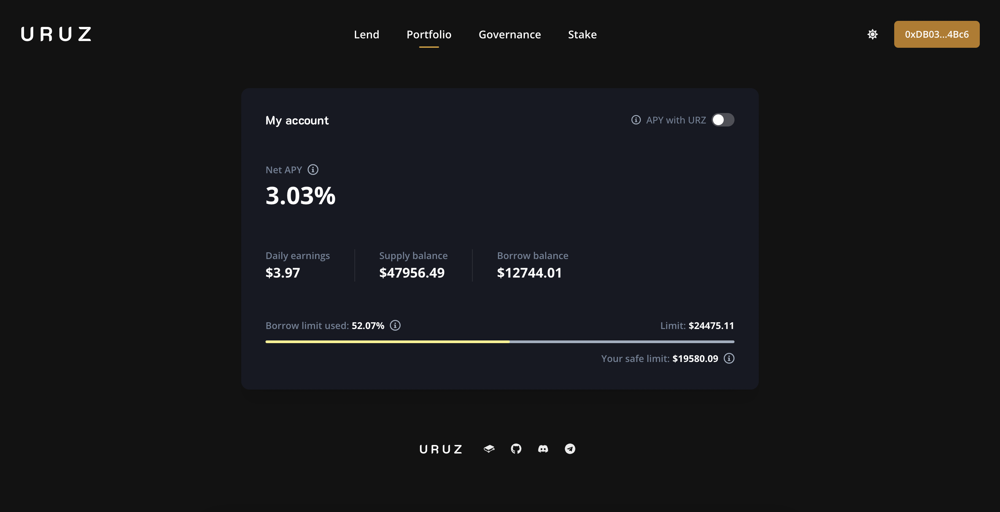
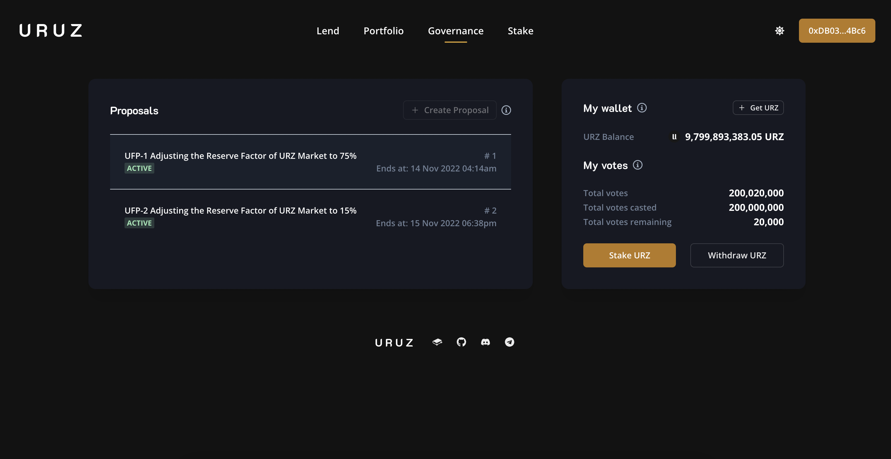
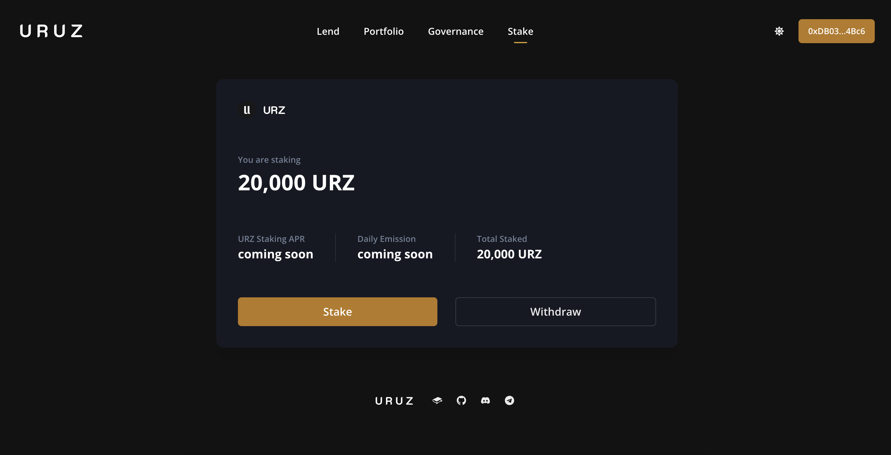

# Uruz Finance

## Overview

Uruz is a decentralized, non-custodial, pool-based interest rates platform that enables users to supply assets to earn interest, and to borrow against them to unlock liquidity.

- [Uruz](https://uruz-finance-near-landing.vercel.app/)
- [Demo Video](https://vimeo.com/772988002)

### Contract Addresses

Here are the deployed contract addresses:

Comptroller [0x942DafED7AC98becC7678a911610D04f0a43dD7e](https://testnet.aurorascan.dev/address/0x942DafED7AC98becC7678a911610D04f0a43dD7e)

Unitroller [0xF2e97e474db0341f234bf4E2530a070CE3ebf57c](https://testnet.aurorascan.dev/address/0xF2e97e474db0341f234bf4E2530a070CE3ebf57c)

jumpRate ETH JumpRateModelV2 [0x9d3839EF57C38F41EF0895A13F2C0A9b03661A4E](https://testnet.aurorascan.dev/address/0x9d3839ef57c38f41ef0895a13f2c0a9b03661a4e)

ETH CEther [0x5214FabaF182583Fd5255AD0d342fAcf0310d422](https://testnet.aurorascan.dev/address/0x5214FabaF182583Fd5255AD0d342fAcf0310d422)

URZ [0x71431Ea524904AE6824E5cB2D8A950C5713660A9](https://testnet.aurorascan.dev/address/0x71431Ea524904AE6824E5cB2D8A950C5713660A9)

WURZ [0x659c456066734aC9b0da7632f43E005C5bb79Dda](https://testnet.aurorascan.dev/address/0x659c456066734aC9b0da7632f43E005C5bb79Dda)

URZ CErc20Delegate [0x7b5394DCa2A5442041e71B968507DA240454BFF3](https://testnet.aurorascan.dev/address/0x7b5394DCa2A5442041e71B968507DA240454BFF3)

URZ CErc20Delegator [0xb2519B737388d8F81336629986255C4cffe6cac9](https://testnet.aurorascan.dev/address/0xb2519B737388d8F81336629986255C4cffe6cac9)

NEAR CErc20Delegate [0x4364e0B7F6110baEB0D436218688F07A82765Fc0](https://testnet.aurorascan.dev/address/0x4364e0B7F6110baEB0D436218688F07A82765Fc0)

NEAR CErc20Delegator [0x8422A5442DccD4E330Ff92b70E365eE2E2B22078](https://testnet.aurorascan.dev/address/0x8422A5442DccD4E330Ff92b70E365eE2E2B22078)

PriceOracle [0xC2F202B044Da3997451b91c51fc1aE3d9E02FAF6](https://testnet.aurorascan.dev/address/0xC2F202B044Da3997451b91c51fc1aE3d9E02FAF6)

PriceOracleProxy [0xdb4D2e78227f2d37D5731f43eFAedEBD734c4641](https://testnet.aurorascan.dev/address/0xdb4D2e78227f2d37D5731f43eFAedEBD734c4641)

GovernorAlpha [0x2835538927f0a6b72dE40B3005c58B821f36C28d](https://testnet.aurorascan.dev/address/0x2835538927f0a6b72dE40B3005c58B821f36C28d)

Timelock [0xaf7Af925Ae728C50d8c3A6ec300d1067826eBEEb](https://testnet.aurorascan.dev/address/0xaf7Af925Ae728C50d8c3A6ec300d1067826eBEEb)

## Screenshots

**Landing Page**

**Markets**

**Market Details**

**Supply**

**Portfolio**

**Governance**

**Stake**

